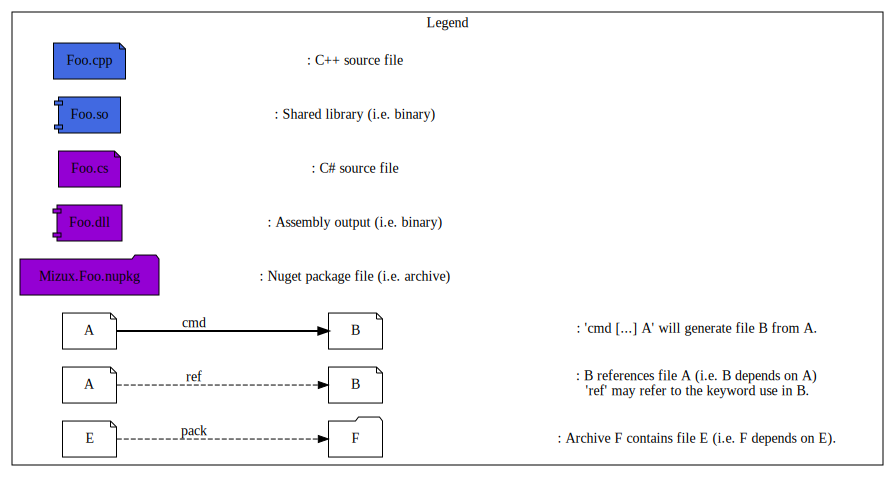
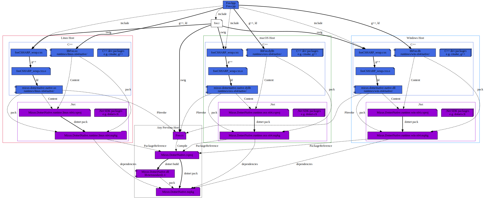

[![Build Status][travis_status]][travis_link]
[![Build Status][appveyor_status]][appveyor_link]

[travis_status]: https://travis-ci.com/Mizux/dotnet-native.svg?branch=master
[travis_link]: https://travis-ci.com/Mizux/dotnet-native

[appveyor_status]: https://ci.appveyor.com/api/projects/status/q105jch2jxxb5t4f/branch/master?svg=true
[appveyor_link]: https://ci.appveyor.com/project/Mizux/dotnet-native/branch/master

# Introduction
This project aim to explain how you build a .NetStandard2.0 native (for win-x64, linux-x64 and osx-x64) nuget multiple package using [`.NET Core CLI`](https://docs.microsoft.com/en-us/dotnet/core/tools/) and the [*new* .csproj format](https://docs.microsoft.com/en-us/dotnet/core/tools/csproj).  
e.g. You have a cross platform C++ library and a .NetStandard2.0 wrapper on it thanks to SWIG.  
Then you want to provide a cross-platform Nuget package to consume it in a .NetCoreApp2.1 project...

## Table of Content
* [Requirement](#requirement)
* [Directory Layout](#directory-layout)
* [Build Process](#build-process)
  * [Local Mizux.Foo Package](#local-mizuxfoo-package)
    * [Building a runtime Mizux.Foo Package](#building-local-runtime-mizuxfoo-package)
    * [Building a Local Mizux.Foo Package](#building-local-mizuxfoo-package)
    * [Testing the Local Mizux.Foo Package](#testing-local-mizuxfoo-package)
  * [Complete Mizux.Foo Package](#complete-mizuxfoo-package)
    * [Building all runtime Mizux.Foo Package](#building-all-runtime-mizuxfoo-package)
    * [Building a Complete Mizux.Foo Package](#building-complete-mizuxfoo-package)
    * [Testing the Complete Mizux.Foo Package](#testing-complete-mizuxfoo-package)
* [Appendices](#appendices)
  * [Ressources](#ressources)
  * [Issues](#issues)
* [Misc](#misc)

# Requirement
You'll need the ".Net Core SDK >= 2.1.302" to get the dotnet cli.
i.e. We won't/can't rely on VS 2019 since we want a portable cross-platform [`dotnet/cli`](https://github.com/dotnet/cli) pipeline. 

# Directory Layout
The project layout is as follow:

* [CMakeLists.txt](CMakeLists.txt) Top-level for [CMake](https://cmake.org/cmake/help/latest/) based build.
* [cmake](cmake) Subsidiary CMake files.

* [ci](ci) Root directory for continuous integration.

* [Foo](Foo) Root directory for `Foo` library.
  * [CMakeLists.txt](Foo/CMakeLists.txt) for `Foo`.
  * [include](Foo/include) public folder.
    * [foo](Foo/include/foo)
      * [Foo.hpp](Foo/include/foo/Foo.hpp)
  * [dotnet](Foo/dotnet)
    * [CMakeLists.txt](Foo/dotnet/CMakeLists.txt) for `Foo` .Net.
    * [foo.i](Foo/dotnet/foo.i) SWIG .Net wrapper.
  * [src](Foo/src) private folder.
    * [src/Foo.cpp](Foo/src/Foo.cpp)
* [dotnet](dotnet) Root directory for .Net template files
  * [`Mizux.Foo.runtime.csproj.in`](dotnet/Mizux.Foo.runtime.csproj.in) csproj template for the .Net "native" (i.e. RID dependent) package.
  * [`Mizux.Foo.csproj.in`](dotnet/Mizux.Foo.csproj.in) csproj template for the .Net package.

note: While Microsoft use `runtime-<rid>.Company.Project` for native package naming,
it is very difficult to get ownership on it, so you should prefer to use`Company.Project.runtime-<rid>` instead since you can have ownership on `Company.*` prefix more easily.

# Build Process
To Create a native dependent package we will split it in two parts:
- A bunch of `Mizux.Foo.runtime.{rid}.nupkg` packages for each 
[Runtime Identifier (RId)](https://docs.microsoft.com/en-us/dotnet/core/rid-catalog) targeted.
- A meta-package `Mizux.Foo.nupkg` depending on each runtime packages.

note: [`Microsoft.NetCore.App` packages](https://www.nuget.org/packages?q=Microsoft.NETCore.App)
follow this layout.

We have two use case scenario:
1. Locally, be able to build a Mizux.Foo package which **only** target the local `OS Platform`,
i.e. building for only one 
[Runtime Identifier (RID)](https://docs.microsoft.com/en-us/dotnet/core/rid-catalog).  
note: This is usefull when the C++ build is a complex process for Windows, Linux and MacOS.  
i.e. You don't support cross-compilation for the native library.

2. Be able to create a complete cross-platform (ed. platform as multiple rid) Mizux.Foo package.  
i.e. First you generate each native Nuget package (`Mizux.Foo.runtime.{rid}.nupkg`) 
on each native architecture, then copy paste these artifacts on one native machine
to generate the meta-package `Mizux.Foo`.

## Local Mizux.Foo Package
Let's start with scenario 1: Create a *Local* `Mizux.Foo.nupkg` package targeting **one** [Runtime Identifier (RID)](https://docs.microsoft.com/en-us/dotnet/core/rid-catalog).  
We would like to build a `Mizux.Foo.nupkg` package which only depends on one `Mizux.Foo.runtime.{rid}.nupkg` in order to dev/test locally.  

The pipeline for `linux-x64` should be as follow:  
note: The pipeline will be similar for `osx-x64` and `win-x64` architecture, don't hesitate to look at the CI log.



### Building local runtime Mizux.Foo Package
disclaimer: for simplicity, in this git repository, we suppose the `g++` and `swig` process has been already performed.  
Thus we have the C++ shared library `Native.so` and the swig generated C# wrapper `Native.cs` already available.  
note: For a C++ CMake cross-platform project sample, take a look at [Mizux/cmake-cpp](https://github.com/Mizux/cmake-cpp).   
note: For a C++/Swig CMake cross-platform project sample, take a look at [Mizux/cmake-swig](https://github.com/Mizux/cmake-swig). 

So first let's create the local `Mizux.Foo.runtime.{rid}.nupkg` nuget package.

Here some dev-note concerning this `Mizux.Foo.runtime.{rid}.csproj`.
- `AssemblyName` must be `Mizux.Foo.dll` i.e. all {rid} projects **must** generate an assembly with the **same** name (i.e. no {rid} in the name)
  ```xml
  <RuntimeIdentifier>{rid}</RuntimeIdentifier>
  <AssemblyName>Mizux.Foo</AssemblyName>
  <PackageId>runtime.{rid}.Mizux.Foo</PackageId>
  ```
- Once you specify a `RuntimeIdentifier` then `dotnet build` or `dotnet build -r {rid}` 
will behave identically (save you from typing it).
  - note: not the case if you use `RuntimeIdentifiers` (notice the 's')
- It is [recommended](https://docs.microsoft.com/en-us/nuget/create-packages/native-packages)
to add the tag `native` to the 
[nuget package tags](https://docs.microsoft.com/en-us/dotnet/core/tools/csproj#packagetags)
  ```xml
  <PackageTags>native</PackageTags>
  ```
- Specify the output target folder for having the assembly output in `runtimes/{rid}/lib/{framework}` in the nupkg
  ```xml
  <BuildOutputTargetFolder>runtimes/$(RuntimeIdentifier)/lib</BuildOutputTargetFolder>
  ```
  note: Every files with an extension different from `.dll` will be filter out by nuget.
- Add the native shared library to the nuget package in the repository `runtimes/{rid}/native`. e.g. for linux-x64:
  ```xml
  <Content Include="*.so">
    <PackagePath>runtimes/linux-x64/native/%(Filename)%(Extension)</PackagePath>
    <Pack>true</Pack>
    <CopyToOutputDirectory>PreserveNewest</CopyToOutputDirectory>
  </Content>
  ```
- Generate the runtime package to a defined directory (i.e. so later in meta Foo package we will be able to locate it)
  ```xml
  <PackageOutputPath>{...}/packages</PackageOutputPath>
  ```
- Generate the Reference Assembly (but don't include it to this runtime nupkg !, see below for explanation) using:
  ```xml
  <ProduceReferenceAssembly>true</ProduceReferenceAssembly>
  ```

Then you can generate the package using:
```bash
dotnet pack Mizux.Foo.runtime.{rid}
```
note: this will automatically trigger the `dotnet build`.

If everything good the package (located where your `PackageOutputPath` was defined) should have this layout:
```
{...}/packages/Mizux.Foo.runtime.{rid}.nupkg:
\- Mizux.Foo.runtime.{rid}.nuspec
\- runtimes
   \- {rid}
      \- native
         \- *.so / *.dylib / *.dll
... 
```
note: `{rid}` could be `linux-x64` and `{framework}` could be `netstandard2.0`

tips: since nuget package are zip archive you can use `unzip -l <package>.nupkg` to study their layout.

### Building local Mizux.Foo Package
So now, let's create the local `Mizux.Foo.nupkg` nuget package which will depend on our previous runtime package.

Here some dev-note concerning this `Foo.csproj`.
- This package is a meta-package so we don't want to ship an empty assembly file:
  ```xml
  <IncludeBuildOutput>false</IncludeBuildOutput>
  ```
- Add the previous package directory:
  ```xml
  <RestoreSources>{...}/packages;$(RestoreSources)</RestoreSources>
  ```
- Add dependency (i.e. `PackageReference`) on each runtime package(s) availabe:
  ```xml
  <ItemGroup Condition="Exists('{...}/packages/Mizux.Foo.runtime.linux-x64.1.0.0.nupkg')">
    <PackageReference Include="Mizux.Foo.runtime.linux-x64" Version="1.0.0" />
  </ItemGroup>
  ```
  Thanks to the `RestoreSource` we can work locally we our just builded package
  without the need to upload it on [nuget.org](https://www.nuget.org/).
- To expose the .Net Surface API the `Foo.csproj` must contains a least one 
[Reference Assembly](https://docs.microsoft.com/en-us/nuget/reference/nuspec#explicit-assembly-references) of the previously rumtime package.
  ```xml
  <Content Include="../Mizux.Foo.runtime.{rid}/bin/$(Configuration)/$(TargetFramework)/{rid}/ref/*.dll">
    <PackagePath>ref/$(TargetFramework)/%(Filename)%(Extension)</PackagePath>
    <Pack>true</Pack>
    <CopyToOutputDirectory>PreserveNewest</CopyToOutputDirectory>
  </Content>
  ```

Then you can generate the package using:
```bash
dotnet pack Mizux.Foo
```

If everything good the package (located where your `PackageOutputPath` was defined) should have this layout:
```
{...}/packages/Mizux.Foo.nupkg:
\- Mizux.Foo.nuspec
\- lib
   \- {framework}
      \- Mizux.Foo.dll
\- ref
   \- {framework}
      \- Mizux.Foo.dll
... 
```
note: `{framework}` could be `netstandard2.0` or/and `netstandard2.1`

### Testing local Mizux.Foo Package 
We can test everything is working by using the `FooApp` project.

First you can build it using:
```
dotnet build Mizux.FooApp
```
note: Since FooApp `PackageReference` Foo and add `{...}/packages` to the `RestoreSource`.
During the build of FooApp you can see that `Mizux.Foo` and
`Mizux.Foo.runtime.{rid}` are automatically installed in the nuget cache.

Then you can run it using:
```
dotnet build Mizux.FooApp
```

You should see something like this
```bash
[1] Enter FooApp
[2] Enter Foo
[3] Enter Foo.{rid}
[3] Exit Foo.{rid}
[2] Exit Foo
[1] Exit FooApp
```

## Complete Mizux.Foo Package
Let's start with scenario 2: Create a *Complete* `Mizux.Foo.nupkg` package targeting multiple [Runtime Identifier (RID)](https://docs.microsoft.com/en-us/dotnet/core/rid-catalog).  
We would like to build a `Mizux.Foo.nupkg` package which depends on several `runtime.{rid}.Mizux.Foo.nupkg`.  

The pipeline should be as follow:  
note: This pipeline should be run on any architecture,
provided you have generated the three architecture dependent `runtime.{rid}.Mizux.Foo.nupkg` nuget packages.



### Building All runtime Mizux.Foo Package 
Like in the previous scenario, on each targeted OS Platform you can build the coresponding
`runtime.{rid}.Mizux.Foo.nupkg` package.

Simply run on each platform
```bash
dotnet build runtime.{rid}.Mizux.Foo
dotnet pack runtime.{rid}.Mizux.Foo
```
note: replace `{rid}` by the Runtime Identifier associated to the current OS platform.

Then on one machine used, you copy all other packages in the `{...}/packages` so
when building `Foo.csproj` we can have access to all package...

### Building Complete Mizux.Foo Package 
This is the same step than in the previous scenario, since we "see" all runtime
packages in `{...}/packages`, the project will depends on each of them.

Once copied all runtime package locally, simply run:
```bash
dotnet build Mizux.Foo
dotnet pack Mizux.Foo
```

### Testing Complete Mizux.Foo Package 
We can test everything is working by using the `FooApp` project.

First you can build it using:
```
dotnet build Mizux.FooApp
```
note: Since FooApp `PackageReference` Foo and add `{...}/packages` to the `RestoreSource`.
During the build of FooApp you can see that `Mizux.Foo` and
`runtime.{rid}.Mizux.Foo` are automatically installed in the nuget cache.

Then you can run it using:
```
dotnet run --project Mizux.FooApp
```

You should see something like this
```bash
[1] Enter FooApp
[2] Enter Foo
[3] Enter Foo.{rid}
[3] Exit Foo.{rid}
[2] Exit Foo
[1] Exit FooApp
```

# Appendices
Few links on the subject...

## Ressources
- [.NET Core RID Catalog](https://docs.microsoft.com/en-us/dotnet/core/rid-catalog)
- [Creating native packages](https://docs.microsoft.com/en-us/nuget/create-packages/native-packages)
- [Blog on Nuget Rid Graph](https://natemcmaster.com/blog/2016/05/19/nuget3-rid-graph/)

- [Common MSBuild project properties](https://docs.microsoft.com/en-us/visualstudio/msbuild/common-msbuild-project-properties?view=vs-2017)
- [MSBuild well-known item metadata](https://docs.microsoft.com/en-us/visualstudio/msbuild/msbuild-well-known-item-metadata?view=vs-2017)
- [Additions to the csproj format for .NET Core](https://docs.microsoft.com/en-us/dotnet/core/tools/csproj)

## Issues
Some issue related to this process
- [Nuget needs to support dependencies specific to target runtime #1660](https://github.com/NuGet/Home/issues/1660)
- [Improve documentation on creating native packages #238](https://github.com/NuGet/docs.microsoft.com-nuget/issues/238)
- [Guide for packaging C# library using P/Invoke](https://github.com/NuGet/Home/issues/8623)

# Misc
Image has been generated using [plantuml](http://plantuml.com/):
```bash
plantuml -Tpng doc/{file}.dot
```
So you can find the dot source files in [doc](doc).

# License

Apache 2. See the LICENSE file for details.

# Disclaimer

This is not an official Google product, it is just code that happens to be
owned by Google.
