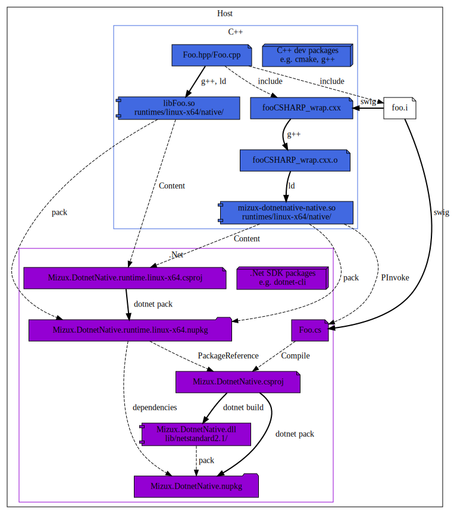
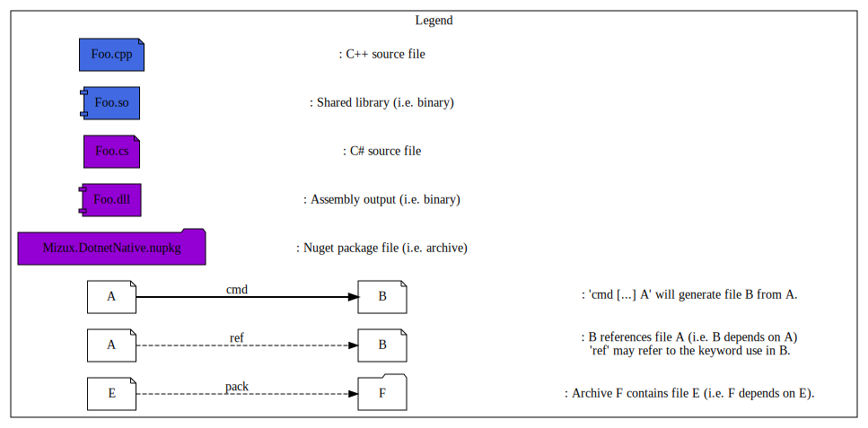
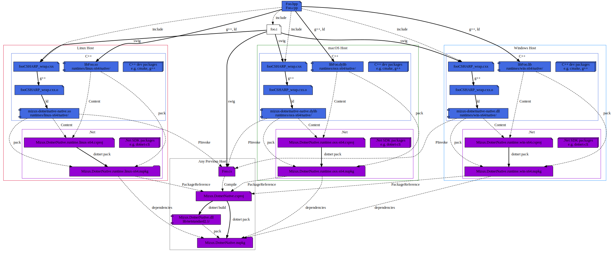

Github-CI:
[![Build Status][github_linux_status]][github_linux_link]
[![Build Status][github_macos_status]][github_macos_link]
[![Build Status][github_windows_status]][github_windows_link]
[![Build Status][github_amd64_docker_status]][github_amd64_docker_link]

[github_linux_status]: https://github.com/Mizux/dotnet-native/actions/workflows/amd64_linux.yml/badge.svg
[github_linux_link]: https://github.com/Mizux/dotnet-native/actions/workflows/amd64_linux.yml
[github_macos_status]: https://github.com/Mizux/dotnet-native/actions/workflows/amd64_macos.yml/badge.svg
[github_macos_link]: https://github.com/Mizux/dotnet-native/actions/workflows/amd64_macos.yml
[github_windows_status]: https://github.com/Mizux/dotnet-native/actions/workflows/amd64_windows.yml/badge.svg
[github_windows_link]: https://github.com/Mizux/dotnet-native/actions/workflows/amd64_windows.yml
[github_amd64_docker_status]: https://github.com/Mizux/dotnet-native/actions/workflows/amd64_docker.yml/badge.svg
[github_amd64_docker_link]: https://github.com/Mizux/dotnet-native/actions/workflows/amd64_docker.yml

# Introduction
<nav for="project"> |
<a href="#requirement">Requirement</a> |
<a href="#codemap">Codemap</a> |
<a href="#dependencies">Dependencies</a> |
<a href="#build-process">Build</a> |
<a href="ci/README.md">CI</a> |
<a href="#appendices">Appendices</a> |
<a href="#license">License</a> |
</nav>

This is an example of how to create a Modern [CMake](https://cmake.org/) C++/.Net Project.

This project aim to explain how you build a .NetStandard2.0 native (win-x64,
linux-x64 and osx-x64) nuget multiple package using
[`.NET Core CLI`](https://docs.microsoft.com/en-us/dotnet/core/tools/) and the
[*new* .csproj format](https://docs.microsoft.com/en-us/dotnet/core/tools/csproj).<br>
e.g. You have a cross platform C++ library (using a CMake based build) and a .NetStandard2.0 wrapper on it thanks to SWIG.  
Then you want to provide a cross-platform Nuget package to consume it in a .NetCoreApp3.1 project...

## Requirement

You'll need:

* "CMake >= 3.18".
* ".Net Core SDK >= 3.1" to get the dotnet cli.

note: We won't/can't rely on VS 2019 since we want a portable cross-platform [`dotnet/cli`](https://github.com/dotnet/cli) pipeline.

## Codemap

The project layout is as follow:

* [CMakeLists.txt](CMakeLists.txt) Top-level for [CMake](https://cmake.org/cmake/help/latest/) based build.
* [cmake](cmake) Subsidiary CMake files.
  * [dotnet.cmake](cmake/dotnet.cmake) All internall .Net CMake stuff.

* [ci](ci) Root directory for continuous integration.

* [Foo](Foo) Root directory for `Foo` library.
  * [CMakeLists.txt](Foo/CMakeLists.txt) for `Foo`.
  * [include](Foo/include) public folder.
    * [foo](Foo/include/foo)
      * [Foo.hpp](Foo/include/foo/Foo.hpp)
  * [src](Foo/src) private folder.
    * [src/Foo.cpp](Foo/src/Foo.cpp)
  * [dotnet](Foo/dotnet)
    * [CMakeLists.txt](Foo/dotnet/CMakeLists.txt) for `Foo` .Net.
    * [foo.i](Foo/dotnet/foo.i) SWIG .Net wrapper.
* [Bar](Bar) Root directory for `Bar` library.
  * [CMakeLists.txt](Bar/CMakeLists.txt) for `Bar`.
  * [include](Bar/include) public folder.
    * [bar](Bar/include/bar)
      * [Bar.hpp](Bar/include/bar/Bar.hpp)
  * [src](Bar/src) private folder.
    * [src/Bar.cpp](Bar/src/Bar.cpp)
  * [dotnet](Bar/dotnet)
    * [CMakeLists.txt](Bar/dotnet/CMakeLists.txt) for `Bar` .Net.
    * [bar.i](Bar/dotnet/bar.i) SWIG .Net wrapper.
* [FooBar](FooBar) Root directory for `FooBar` library.
  * [CMakeLists.txt](FooBar/CMakeLists.txt) for `FooBar`.
  * [include](FooBar/include) public folder.
    * [foobar](FooBar/include/foobar)
      * [FooBar.hpp](FooBar/include/foobar/FooBar.hpp)
  * [src](FooBar/src) private folder.
    * [src/FooBar.cpp](FooBar/src/FooBar.cpp)
  * [dotnet](FooBar/dotnet)
    * [CMakeLists.txt](FooBar/dotnet/CMakeLists.txt) for `FooBar` .Net.
    * [foobar.i](Bar/dotnet/foobar.i) SWIG .Net wrapper.

* [dotnet](dotnet) Root directory for .Net template files
  * [`Mizux.DotnetNative.runtime.csproj.in`](dotnet/Mizux.DotnetNative.runtime.csproj.in) csproj template for the .Net "native" (i.e. RID dependent) package.
  * [`Mizux.DotnetNative.csproj.in`](dotnet/Mizux.DotnetNative.csproj.in) csproj template for the .Net package.
  * [`Test.csproj.in`](dotnet/Test.csproj.in) csproj template for .Net test project.
  * [`Example.csproj.in`](dotnet/Example.csproj.in) csproj template for .Net example project.

* [tests](tests) Root directory for tests
  * [CMakeLists.txt](tests/CMakeLists.txt) for `DotnetNative.Test` .Net.
  * [`FooTests.cs`](tests/FooTests.cs) Code of the Mizux.DotnetNative.FooTests project.

* [examples](examples) Root directory for examples
  * [CMakeLists.txt](examples/CMakeLists.txt) for `DotnetNative.FooApp` .Net.
  * [`FooApp.cs`](examples/FooApp.cs) Code of the `DotnetNative.FooApp` app.

## Dependencies
To complexify a little, the CMake project is composed of three libraries (Foo, Bar and FooBar)
with the following dependencies:  
```sh
Foo:
Bar:
FooBar: PUBLIC Foo PRIVATE Bar
```

## Build Process

To Create a native dependent package we will split it in two parts:

* A bunch of `Mizux.DotnetNative.runtime.{rid}.nupkg` packages for each 
[Runtime Identifier (RId)](https://docs.microsoft.com/en-us/dotnet/core/rid-catalog) targeted containing the native libraries.
* A generic package `Mizux.DotnetNative.nupkg` depending on each runtime packages and
containing the managed .Net code.

Actually, You don't need a specific variant of .Net Standard wrapper, simply omit the library extension and .Net magic will pick
the correct native library.  
ref: https://www.mono-project.com/docs/advanced/pinvoke/#library-names

note: [`Microsoft.NetCore.App` packages](https://www.nuget.org/packages?q=Microsoft.NETCore.App)
follow this layout.

note: While Microsoft use `runtime-<rid>.Company.Project` for native libraries
naming, it is very difficult to get ownership on it, so you should prefer to use
`Company.Project.runtime-<rid>` instead since you can have ownership on
`Company.*` prefix more easily.

We have two use case scenario:

1.  Locally, be able to build a Mizux.DotnetNative package which **only** target the
    local `OS Platform`, i.e. building for only one
    [Runtime Identifier (RID)](https://docs.microsoft.com/en-us/dotnet/core/rid-catalog).
    \
    note: This is useful since the C++ build is a complex process for Windows,
    Linux and MacOS. i.e. We don't support cross-compilation for the native
    library generation.

2.  Be able to create a complete cross-platform (ed. platform as multiple rid)
    Mizux.DotnetNative package. \
    i.e. First you generate each native Nuget package
    (`Mizux.DotnetNative.runtime.{rid}.nupkg`) on each native architecture, then
    copy paste these artifacts on one native machine to generate the
    meta-package `Mizux.DotnetNative`.

### Local Mizux.DotnetNative Package

Let's start with scenario 1: Create a *Local only* `Mizux.DotnetNative.nupkg` package targeting **one**
[Runtime Identifier (RID)](https://docs.microsoft.com/en-us/dotnet/core/rid-catalog).  
We would like to build a `Mizux.DotnetNative.nupkg` package which only depends
on one `Mizux.DotnetNative.runtime.{rid}.nupkg` in order to work locally.

The pipeline for `linux-x64` should be as follow:


note: The pipeline will be similar for `osx-x64` and `win-x64` architecture,
don't hesitate to look at the CI log.

#### Building local runtime Mizux.DotnetNative Package

disclaimer: In this git repository, we use `CMake` and `SWIG`.  
Thus we have the C++ shared library `libFoo.so` and the SWIG generated .Net wrapper `Foo.cs`.  
note: For a C++ CMake cross-platform project sample, take a look at [Mizux/cmake-cpp](https://github.com/Mizux/cmake-cpp).   
note: For a C++/Swig CMake cross-platform project sample, take a look at [Mizux/cmake-swig](https://github.com/Mizux/cmake-swig). 

So first let's create the local `Mizux.DotnetNative.runtime.{rid}.nupkg` nuget package.

Here some dev-note concerning this `Mizux.DotnetNative.runtime.{rid}.csproj`.
* Once you specify a `RuntimeIdentifier` then `dotnet build` or `dotnet build -r {rid}` 
will behave identically (save you from typing it).
  * note: it is **NOT** the case if you use `RuntimeIdentifiers` (notice the 's')
* It is [recommended](https://docs.microsoft.com/en-us/nuget/create-packages/native-packages)
to add the tag `native` to the 
[nuget package tags](https://docs.microsoft.com/en-us/dotnet/core/tools/csproj#packagetags)
  ```xml
  <PackageTags>native</PackageTags>
  ```
* This package is a runtime package so we don't want to ship an empty assembly file:
  ```xml
  <IncludeBuildOutput>false</IncludeBuildOutput>
  ```
* Add the native (i.e. C++) libraries to the nuget package in the repository `runtimes/{rid}/native`. e.g. for linux-x64:
  ```xml
  <Content Include="*.so">
    <PackagePath>runtimes/linux-x64/native/%(Filename)%(Extension)</PackagePath>
    <Pack>true</Pack>
    <CopyToOutputDirectory>PreserveNewest</CopyToOutputDirectory>
  </Content>
  ```
* Generate the runtime package to a defined directory (i.e. so later in
  `Mizux.DotnetNative` package we will be able to locate it)
  ```xml
  <PackageOutputPath>{...}/packages</PackageOutputPath>
  ```

Then you can generate the package using:

```bash
dotnet pack Mizux.DotnetNative.runtime.{rid}
```
note: this will automatically trigger the `dotnet build`.

If everything good the package (located where your `PackageOutputPath` was defined) should have this layout:

```
{...}/packages/Mizux.DotnetNative.runtime.{rid}.nupkg:
\- Mizux.DotnetNative.runtime.{rid}.nuspec
\- runtimes
   \- {rid}
      \- native
         \- *.so / *.dylib / *.dll
...
```
note: `{rid}` could be `linux-x64` and `{framework}` could be `netstandard2.0`

tips: since nuget package are zip archive you can use `unzip -l <package>.nupkg`
to study their layout.

#### Building local Mizux.DotnetNative Package

So now, let's create the local `Mizux.DotnetNative.nupkg` nuget package which will
depend on our previous runtime package.

Here some dev-note concerning this `DotnetNative.csproj`.
* Add the previous package directory:
  ```xml
  <RestoreSources>{...}/packages;$(RestoreSources)</RestoreSources>
  ```
* Add dependency (i.e. `PackageReference`) on each runtime package(s) availabe:
  ```xml
  <ItemGroup>
    <RuntimeLinux Include="{...}/packages/Mizux.DotnetNative.runtime.linux-x64.*.nupkg"/>
    <RuntimeOsx   Include="{...}/packages/Mizux.DotnetNative.runtime.osx-x64.*.nupkg"/>
    <RuntimeWin   Include="{...}/packages/Mizux.DotnetNative.runtime.win-x64.*.nupkg"/>
    <PackageReference Include="Mizux.DotnetNative.runtime.linux-x64" Version="1.0" Condition="Exists('@(RuntimeLinux)')"/>
    <PackageReference Include="Mizux.DotnetNative.runtime.osx-x64"   Version="1.0" Condition="Exists('@(RuntimeOsx)')"  />
    <PackageReference Include="Mizux.DotnetNative.runtime.win-x64"   Version="1.0" Condition="Exists('@(RuntimeWin)')"  />
  </ItemGroup>
  ```
  Thanks to the `RestoreSource` we can work locally we our just builded package
  without the need to upload it on [nuget.org](https://www.nuget.org/).

Then you can generate the package using:

```bash
dotnet pack Mizux.DotnetNative
```

If everything good the package (located where your `PackageOutputPath` was
defined) should have this layout:

```
{...}/packages/Mizux.DotnetNative.nupkg:
\- Mizux.DotnetNative.nuspec
\- lib
   \- {framework}
      \- Mizux.DotnetNative.dll
...
```
note: `{framework}` could be `netcoreapp3.1` or/and `net6.0`

#### Testing local Mizux.DotnetNative.FooApp Package

We can test everything is working by using the `Mizux.DotnetNative.FooApp` or `Mizux.DotnetNative.FooTests` project.

First you can build it using:
```
dotnet build <build_dir>/dotnet/FooApp
```
note: Since `Mizux.DotnetNative.FooApp` `PackageReference` Mizux.DotnetNative and add `{...}/packages` to the `RestoreSource`.
During the build of DotnetNative.FooApp you can see that `Mizux.DotnetNative` and
`Mizux.DotnetNative.runtime.{rid}` are automatically installed in the nuget cache.

Then you can run it using:
```
dotnet run --project <build_dir>/dotnet/FooApp/FooApp.csproj
```
note: Contrary to `dotnet build` and `dotnet pack` you must use `--project`
before the `.csproj` path (let's call it "dotnet cli command consistency")

You should see:
```sh
$ dotnet run --project build/dotnet/FooApp/FooApp.csproj
[1] Enter DotnetNativeApp
[2] Enter Foo::staticFunction(int)
[3] Enter freeFunction(int)
[3] Exit freeFunction(int)
[2] Exit Foo::staticFunction(int)
[1] Exit DotnetNativeApp
```

### Complete Mizux.DotnetNative Package

Let's start with scenario 2: Create a *Complete* `Mizux.DotnetNative.nupkg` package
targeting multiple
[Runtime Identifier (RID)](https://docs.microsoft.com/en-us/dotnet/core/rid-catalog).  
We would like to build a `Mizux.DotnetNative.nupkg` package which depends on several
`Mizux.DotnetNative.runtime.{rid}.nupkg`.

The pipeline should be as follow:  
note: This pipeline should be run on any architecture,
provided you have generated the three architecture dependent `Mizux.DotnetNative.runtime.{rid}.nupkg`
nuget packages.



#### Building All runtime Mizux.DotnetNative Package

Like in the previous scenario, on each targeted OS Platform you can build the
coresponding `Mizux.DotnetNative.runtime.{rid}.nupkg` package.

Simply run on each platform:

```bash
cmake -S. -Bbuild -DCMAKE_BUILD_TYPE=Release
cmake --build build --config Release
```
note: replace `{rid}` by the Runtime Identifier associated to the current OS platform.

Then on one machine used, you copy all other packages in the `{...}/packages` so
when building `Mizux.DotnetNative.csproj` we can have access to all package...

#### Building Complete Mizux.DotnetNative Package

This is the same step than in the previous scenario, since we "see" all runtime
packages in `{...}/packages`, the project will depends on each of them.

Once copied all runtime package locally, simply run:

```bash
dotnet build <build_dir>/dotnet/Mizux.DotnetNative
dotnet pack <build_dir>/dotnet/Mizux.DotnetNative
```

#### Testing Complete Mizux.DotnetNative Package

We can test everything is working by using the `Mizux.DotnetNative.FooApp` or `Mizux.DotnetNative.FooTests` project.

First you can build it using:
```
dotnet build <build_dir>/dotnet/FooApp
```
note: Since Mizux.DotnetNative.FooApp `PackageReference` Mizux.DotnetNative and add `{...}/packages` to the `RestoreSource`.
During the build of Mizux.DotnetNative.FooApp you can see that `Mizux.DotnetNative` and
`Mizux.DotnetNative.runtime.{rid}` are automatically installed in the nuget cache.

Then you can run it using:
```
dotnet run --project <build_dir>/dotnet/FooApp/FooApp.csproj
```

You should see something like this
```bash
$ dotnet run --project build/dotnet/FooApp/FooApp.csproj
[1] Enter DotnetNativeApp
[2] Enter Foo::staticFunction(int)
[3] Enter freeFunction(int)
[3] Exit freeFunction(int)
[2] Exit Foo::staticFunction(int)
[1] Exit DotnetNativeApp
```

## Appendices

Few links on the subject...

.Net runtime can deduce library extension so don’t use a platform-specific
library name in the `DllImport` statement.
Instead, just use the library name itself, without any prefixes or suffixes,
and rely on the runtime to find the appropriate library at runtime.\
ref: [Mono `pinvoke#libraryname`](https://www.mono-project.com/docs/advanced/pinvoke/#library-names)

### Resources

#### Project layout
* [The Pitchfork Layout](https://mizux.github.io/pitchfork/)

#### CMake
* [CMake Reference Documentation](https://cmake.org/cmake/help/latest/index.html)
* https://llvm.org/docs/CMakePrimer.html
* https://cliutils.gitlab.io/modern-cmake/
* https://cgold.readthedocs.io/en/latest/

#### Target Framework Moniker (TFM)

* [.NET TFM list](https://docs.microsoft.com/en-us/dotnet/standard/frameworks)
* [.NET Standard implementation support](https://docs.microsoft.com/en-us/dotnet/standard/net-standard)

#### .Net:Runtime IDentifier (RID)

* [.Net Support Policy](https://dotnet.microsoft.com/en-us/platform/support/policy/dotnet-core)
* [.NET Core RID Catalog](https://docs.microsoft.com/en-us/dotnet/core/rid-catalog)
* [Creating native packages](https://docs.microsoft.com/en-us/nuget/create-packages/native-packages)
* [Blog on Nuget Rid Graph](https://natemcmaster.com/blog/2016/05/19/nuget3-rid-graph/)

#### Reference on .csproj format

* [Common MSBuild project properties](https://docs.microsoft.com/en-us/visualstudio/msbuild/common-msbuild-project-properties?view=vs-2017)
* [MSBuild well-known item metadata](https://docs.microsoft.com/en-us/visualstudio/msbuild/msbuild-well-known-item-metadata?view=vs-2017)
* [Additions to the csproj format for .NET Core](https://docs.microsoft.com/en-us/dotnet/core/tools/csproj)

### Issues

Some issue related to this process
* [`PackageReference` only support `TargetFramework` condition](https://docs.microsoft.com/en-us/nuget/consume-packages/package-references-in-project-files#adding-a-packagereference-condition)
* [Nuget needs to support dependencies specific to target runtime #1660](https://github.com/NuGet/Home/issues/1660)
* [Improve documentation on creating native packages #238](https://github.com/NuGet/docs.microsoft.com-nuget/issues/238)
* [Guide for packaging C# library using P/Invoke](https://github.com/NuGet/Home/issues/8623)

### Misc

Image has been generated using [plantuml](http://plantuml.com/):

```bash
plantuml -Tsvg docs/{file}.dot
```
So you can find the dot source files in [docs](docs).

## License

Apache 2. See the LICENSE file for details.

## Disclaimer

This is not an official Google product, it is just code that happens to be
owned by Google.
