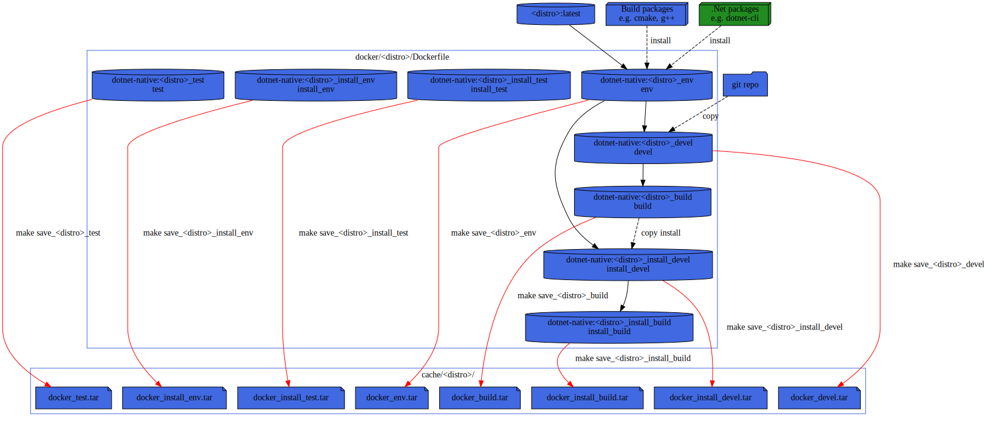

# CI: Makefile/Docker testing
To test the build on various distro, I'm using docker containers and a Makefile for orchestration.

pros:
* You are independent of third party CI runner config (e.g. github actions runners or Travis-CI VM images).
* You can run it locally on your linux system.
* Most CI provide runner with docker and Makefile installed (e.g. Travis-CI [minimal images](https://docs.travis-ci.com/user/languages/minimal-and-generic/).

cons:
* Only GNU/Linux distro supported.
* Could take few GiB (~30 GiB for all distro and all languages)
  * ~500MiB OS + C++/CMake tools,
  * ~400 MiB dotnet-sdk,

# Usage
To get the help simply type:
```sh
make
```

note: you can also use from top directory
```sh
make --directory=ci
```

## Example
For example to test inside an `Alpine` container:
```sh
make alpine_test
```

# Docker layers
Dockerfile is splitted in several stages.


